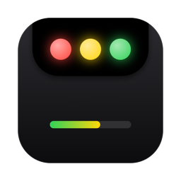
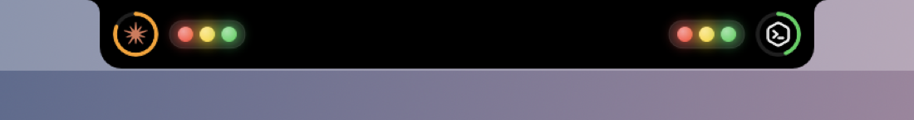
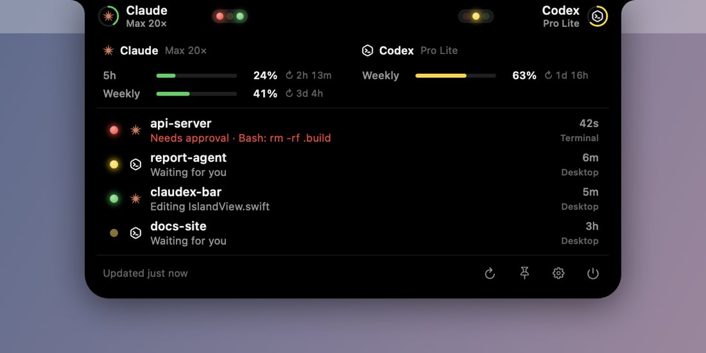
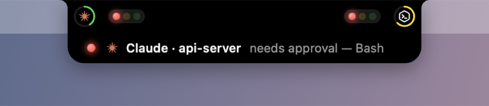
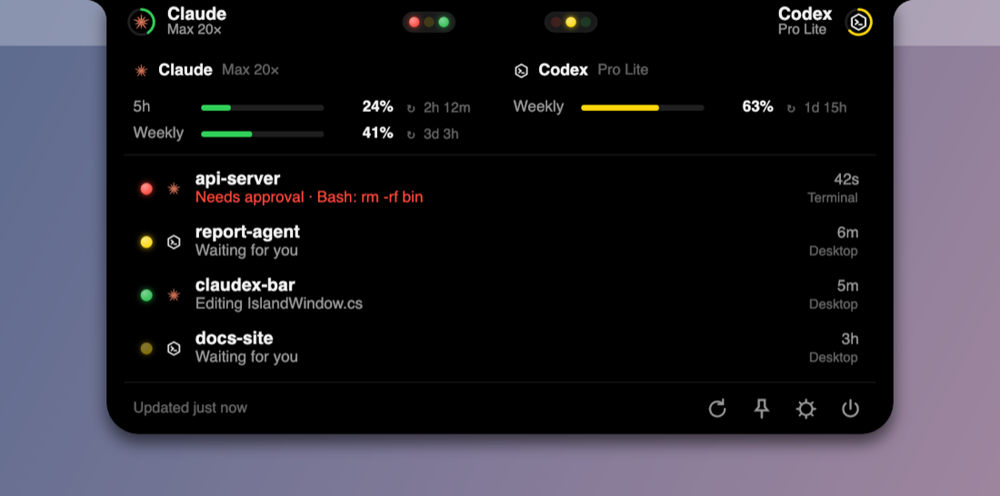

<p align="center"></p>

<h1 align="center">ClaudexBar</h1>

<p align="center">
Live status and usage limits for <b>Claude Code</b> and <b>OpenAI Codex</b>: a traffic light for each agent, right at the top of your screen.<br>
macOS (notch island) · Windows (top island + tray)
</p>

<p align="center"><a href="../../releases/latest"><b>⬇ Download the latest release</b></a></p>





## Traffic lights

| Lamp | Meaning |
|---|---|
| 🟢 green (breathing) | the agent is working |
| 🟡 yellow (steady) | a turn finished and is waiting for your next prompt; dims after 30 min ("parked") |
| 🔴 red (blinking) | needs approval or an answer, or is blocked (error, usage limit reached) |
| all dim | no session |

With several sessions, every lamp whose state is present lights up. For example, red and green together mean one session needs you while another keeps working.

The thin ring around each logo shows the most constrained usage window: green < 50 % < yellow < 80 % < orange < 100 % = red.

- **Hover** to expand: usage bars with reset countdowns, and every session with its activity (`Needs approval · Bash: rm -rf build`, `Running: npm test`, `Question: Deploy target`).
- **Click** to pin it open; **click a session** to bring its app or terminal to the front.
- **Right-click** (macOS) or the **tray icon** (Windows) for Settings and Quit.
- The island **pops out** by itself when a session needs you, a long turn finishes, or usage crosses 80 % / 100 %.



## Install

| System | Download |
|---|---|
| macOS 14+ (Apple Silicon and Intel) | `ClaudexBar-<version>-macOS-universal.zip` |
| Windows 10/11 x64 | `ClaudexBar-<version>-windows-x64.zip` |
| Windows 11 on ARM | `ClaudexBar-<version>-windows-arm64.zip` |

**macOS:**
1. Unzip and move **ClaudexBar.app** to Applications.
2. It isn't notarized, so the first time right-click → **Open** → **Open**. Alternatively, run `xattr -dr com.apple.quarantine /Applications/ClaudexBar.app`.
3. Turn on **Launch at login** in Settings.

**Windows:**
1. Unzip and run **ClaudexBar.exe**. It is self-contained, so no .NET install is needed.
2. It isn't code-signed, so if SmartScreen warns, click **More info** → **Run anyway**.
3. The island sits at the top center of the main screen (top left or top right in Settings), with a tray icon next to the clock. It hides automatically while a full-screen app or game is in front.



## Where the data comes from (read-only)

ClaudexBar never edits Claude or Codex configuration and installs no hooks. It never writes their files, databases or Keychain items. It never refreshes OAuth tokens: refresh tokens rotate, so doing that would sign the tools out.

| What | Source |
|---|---|
| Claude session state | `~/.claude/sessions/<pid>.json`, Claude Code's live registry (`busy` / `idle` / `waiting` + `waitingFor`), the backing store of `claude agents --json` |
| Claude activity detail | tail of `~/.claude/projects/*/<session>.jsonl` (current tool, errors) |
| Claude usage | the Claude app's own `plan-usage-history.json`, plus `api.anthropic.com/api/oauth/usage` when Claude Code's saved login holds a valid token (Keychain on macOS, `~/.claude/.credentials.json` on Windows) |
| Codex session state | rollouts `~/.codex/sessions/**/rollout-*.jsonl` (turn start/end, pending questions), and which threads a running `codex` process has open (libproc on macOS, Restart Manager on Windows) |
| Codex thread names | `~/.codex/state_*.sqlite` (opened immutable/read-only) and `session_index.jsonl` |
| Codex usage | `chatgpt.com/backend-api/wham/usage` with `~/.codex/auth.json`, falling back to the rate limits Codex writes to its rollouts |

These formats are undocumented and can change between versions. The parsers are lenient, and unknown values degrade to "unknown" instead of breaking.

**Known limits:**
- Codex doesn't persist approval prompts, so Codex approvals aren't detected. Questions (`request_user_input`) are.
- Claude reset times appear when an API reading exists, or when the Claude app's sampled history pins the window start to within 30 minutes (shown as `≈`).

## Build from source

**macOS app** (Swift 6.2 / Xcode 26):

```bash
make test           # unit + integration tests
make build          # ad-hoc signed build/ClaudexBar.app
make install        # copy to ~/Applications and launch
make demo           # scripted demo cycling through every state
make release-mac    # universal zip in dist/
```

**Windows app** (.NET 10, builds on Windows, macOS or Linux):

```bash
make test-windows      # xUnit tests
make release-windows   # self-contained x64 + ARM64 zips in dist/
```

Releases are built by GitHub Actions. Bump `VERSION` and push to `main`, and a new release is published with all three downloads.

**Project layout:**
- `Sources/ClaudexCore`: macOS status and usage engine (pure Swift, heavily tested).
- `Sources/ClaudexBar`: the notch island app (AppKit + SwiftUI; lamps animated with Core Animation at ~0 % CPU).
- `windows/`: the Windows port (C# + Avalonia), with the same logic and the same test fixtures.

## Author

Made by **Farrukh Yuldashev**. MIT License, see [LICENSE](LICENSE).

ClaudexBar is an independent project and is not affiliated with Anthropic or OpenAI. "Claude" and "Codex" are trademarks of their respective owners.
