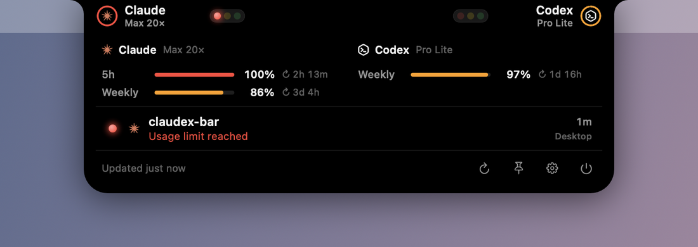
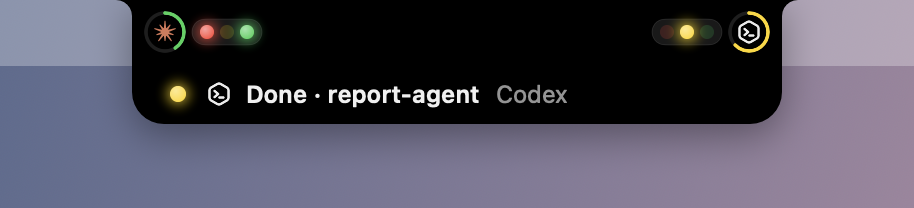
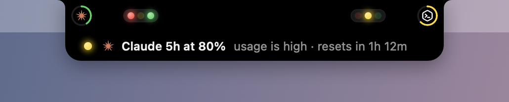

<div align="center">


# ClaudexBar

**A traffic light for Claude Code and OpenAI Codex, right in your MacBook's notch.**

See at a glance which agent is working, which one is done, and which one is waiting for you — and how much of each plan's usage is left. On Windows it sits at the top of the screen, with a tray icon.

[](https://github.com/khudayarovich/claudex-bar/releases/latest)
[](https://github.com/khudayarovich/claudex-bar/actions/workflows/ci.yml)
[](LICENSE)
[](https://github.com/khudayarovich/claudex-bar/releases/latest)
[](https://buymeacoffee.com/khudayarovich)
[](https://github.com/sponsors/khudayarovich)


</div>

## Why

Running Claude Code and Codex side by side means checking windows all day. Is Claude still going? Did Codex stop to ask something ten minutes ago? Is the 5-hour limit about to run out in the middle of a refactor?

ClaudexBar answers all three without a window switch. The notch you look past a hundred times a day becomes a status light: one small traffic light per agent that turns red the moment a session needs you, and a panel that opens on hover with your usage limits and every running session.

## Reading the lights


Claude lives on the left of the notch, Codex on the right. Each side shows the agent's logo inside a usage ring, and a traffic light:

| Lamp | Meaning |
| --- | --- |
| 🟢 **Green**, breathing | The agent is working |
| 🟡 **Yellow**, steady | A turn finished and the session is waiting for your next prompt. After 30 minutes it dims to "parked" |
| 🔴 **Red**, blinking | The session needs you: a permission prompt or a question — or it's blocked by an error or a usage limit |
| All dim | No session is running |

With several sessions, **every lamp whose state is present lights up**. Red and green together mean one session is waiting on you while another keeps working. With a single session it behaves like an ordinary traffic light.

The **ring** around each logo shows the plan's most constrained usage window: green below 50 %, yellow below 80 %, orange below 100 %, red at the limit. No ring means no usage data yet.

When a limit is reached, the bar and the ring turn red and the session says why:



## Using it

- **Hover** over the island to open it: a usage bar for every limit window with its reset countdown, and each session with what it is doing right now — `Needs approval · Bash: rm -rf build`, `Running: npm test`, `Question: Deploy target`, `Waiting for you`. Each row shows how long the session has been in that state, and whether it runs in the desktop app or a terminal.
- **Click** the island to keep it open; click anywhere else to close it.
- **Click a session** to bring its app or terminal window to the front.
- **Right-click** the island (macOS) or use the **tray icon** (Windows) to pin it open, refresh, open Settings or quit.

It also **pops out by itself** for a few seconds when something deserves a look, and stays put while your pointer is on it:

| When | What you see |
| --- | --- |
| A session needs approval or an answer — for 5 s |  |
| A turn longer than 20 s finishes — for 3 s |  |
| Usage crosses 80 % or 100 % — for 4 s |  |

Each kind of pop-out can be turned off in Settings, and a sound can play when a session needs you.

## Install

Download the latest build from the [releases page](https://github.com/khudayarovich/claudex-bar/releases/latest).

| Platform | File | Notes |
| --- | --- | --- |
| macOS 14 or later, Apple Silicon and Intel | `ClaudexBar-<version>-macOS-universal.zip` | Not notarized: the first launch needs **right-click → Open → Open** |
| Windows 10 / 11, x64 | `ClaudexBar-<version>-windows-x64.zip` | Self-contained, no .NET install needed. SmartScreen warns because the exe is unsigned: **More info → Run anyway** |
| Windows 11 on Arm | `ClaudexBar-<version>-windows-arm64.zip` | Same as above |

### macOS

1. Unzip and drag **ClaudexBar.app** into Applications.
2. The first time, right-click it → **Open** → **Open**. Or clear the quarantine flag once:
   ```bash
   xattr -dr com.apple.quarantine /Applications/ClaudexBar.app
   ```
3. The island appears around the notch. On a Mac without one, or with the lid closed, it sits at the top center of the screen as a small pill.
4. Turn on **Launch at login** in Settings → General.

ClaudexBar has no Dock icon. Everything lives on the island and its right-click menu.

### Windows

1. Unzip and run **ClaudexBar.exe** from any folder. There's no installer.
2. If SmartScreen warns, click **More info → Run anyway**.
3. The island appears at the top center of the main screen (or top left / top right, in Settings), and a tiny traffic light appears in the tray. Hover the tray icon for a summary, click it to open the panel, right-click it for the menu.
4. Turn on **Launch ClaudexBar when I sign in** in Settings.


### Updating and removing

- **Update:** quit ClaudexBar, replace the app or exe with the new one, and start it again. Settings are kept.
- **Remove on macOS:** turn off Launch at login, quit, and delete the app. Settings live in `~/Library/Preferences/dev.claudexbar.ClaudexBar.plist`.
- **Remove on Windows:** turn off Launch at sign-in, quit from the tray, and delete the exe and the `%APPDATA%\ClaudexBar` folder.

## Settings

On macOS, open Settings from the right-click menu or the gear in the panel. On Windows, from the tray menu.

| Setting | Default | Notes |
| --- | --- | --- |
| Launch at login | Off | On macOS the app has to be in Applications |
| Show the island on | Notched display | macOS: the built-in notched display, the main display, or every display |
| Position | Top center | Windows: top center, top left or top right |
| Hide over full-screen apps | macOS: off · Windows: on | On Windows this covers games and presentations too |
| Ear width | Regular | macOS: Compact makes the island narrower |
| Show usage ring around each logo | On | |
| Finished turns stay bright for | 30 min | Then yellow dims to "parked". 5 to 240 minutes |
| Pop out when a session needs approval or an answer | On | |
| Pop out when a turn longer than 20 s finishes | On | |
| Pop out when usage crosses 80 % or 100 % | On | |
| Play a sound when a session needs you | Off | |
| Claude: ask Anthropic's usage API with Claude Code's login | On | When off, only the numbers the Claude app already saved are used |
| Codex: ask ChatGPT's usage API with Codex's login | On | When off, only the limits Codex writes to its session logs are used |

## Support the project

ClaudexBar is free, MIT-licensed, and built in the open by one person. It has no paid tier and collects nothing from you. If it saves you a few window switches a day, a sponsorship or a coffee keeps it maintained.

<table>
<tr>
<td width="60%" valign="top">

**Ways to help**

- ⭐ **Star the repository**: free, and the single biggest help
- 🐛 **Report a bug** or suggest a feature in [Issues](https://github.com/khudayarovich/claudex-bar/issues)
- 💛 **Sponsor** or ☕ **buy me a coffee** if ClaudexBar earns a place on your screen

</td>
<td width="40%" valign="top">

**Donate**

<a href="https://github.com/sponsors/khudayarovich"></a>

<a href="https://buymeacoffee.com/khudayarovich"></a>

</td>
</tr>
</table>

## How it works

ClaudexBar reads the files Claude Code and Codex already keep up to date on your machine, and turns them into lamps. File-system events wake it the moment something changes, and every session is checked against the running processes, so a closed or crashed session disappears instead of lingering.

**It is read-only toward both tools.** It installs no hooks and changes no settings. It never writes their files, databases or Keychain items, and never refreshes their logins: refresh tokens rotate, so refreshing one behind a tool's back would sign that tool out.

| What | Where it comes from |
| --- | --- |
| Claude session state | Claude Code's live session registry, `~/.claude/sessions/<pid>.json`: `busy`, `idle`, or `waiting` plus what it's waiting for. It's the same data `claude agents --json` prints |
| Claude activity | The end of the session transcript, `~/.claude/projects/*/<session>.jsonl`: the tool running now, errors, retries |
| Codex session state | Codex's session logs, `~/.codex/sessions/**/rollout-*.jsonl` (turn started, finished or aborted; pending questions; the latest command), plus which sessions a running `codex` process actually has open |
| Codex session names | `~/.codex/state_*.sqlite`, opened read-only, and `session_index.jsonl` |
| Claude usage | Anthropic's usage endpoint, `api.anthropic.com/api/oauth/usage`, with Claude Code's saved login (the macOS Keychain, or `~/.claude/.credentials.json`) while that login holds a valid token. Otherwise, the numbers the Claude desktop app saved in its `plan-usage-history.json` |
| Codex usage | ChatGPT's usage endpoint, `chatgpt.com/backend-api/wham/usage`, with the login in `~/.codex/auth.json`. Otherwise, the rate limits Codex writes into its session logs. On macOS, if the endpoint can't be used and Codex isn't running, ClaudexBar may start a short-lived read-only `codex app-server` to ask, at most every 30 minutes |

`CLAUDE_CONFIG_DIR` and `CODEX_HOME` are respected. On Windows, `~` is your user folder, and the Claude app's data is in `%APPDATA%\Claude`, or in its package folder under `%LOCALAPPDATA%\Packages` when the app is the Microsoft Store (MSIX) version.

Usage is refreshed every 3 minutes for Claude and every 5 for Codex while that agent has sessions, and every 10 and 15 minutes otherwise. `Retry-After` and back-off are honored, and **Refresh now** asks right away. Limit windows are named by their length (**5h**, **Weekly**), whatever the service calls them internally.

These formats are undocumented and change between versions, so every parser is lenient: an unknown value shows as "unknown" instead of breaking the island.

<details>
<summary><b>How a session's color is decided</b></summary>

<br>

**Claude Code**, from the registry status and the transcript:

| State | Lamp |
| --- | --- |
| `busy` | 🟢 Working, with the tool that is running, "Thinking…" or "Retrying (3/10)…" |
| `busy`, but the turn ended cleanly over a minute ago and nothing is pending | 🟡 Background task running |
| `waiting` | 🔴 A permission prompt, a plan to approve, a question, or an open dialog |
| `idle` | 🟡 Waiting for you, or 🔴 when the turn ended in an error ("Usage limit reached" for a rate limit) |
| `shell` | 🟡 The turn is done; a background shell is still running |

**Codex**, from the session log of every session a Codex process has open:

| State | Lamp |
| --- | --- |
| A turn started and hasn't finished | 🟢 Working, with the latest command |
| A question (`request_user_input`) is unanswered | 🔴 Question |
| The turn completed | 🟡 Waiting for you, or 🔴 when it failed (for example on a usage limit) |
| The turn was aborted, or Codex restarted mid-turn | 🟡 Interrupted |
| A turn has been silent for more than 2 hours | 🟡 May be stuck |

Codex sessions are shown while a Codex process has them open and they're mid-turn or were active in the last 12 hours, unless they're archived or belong to a sub-agent.

A switch to yellow has to hold for 1.5 seconds before it shows, so a session moving between tool calls doesn't flicker. Red and green show immediately.

</details>

<details>
<summary><b>What's inside the apps</b></summary>

<br>

- **One engine per platform, same rules.** The macOS engine (`ClaudexCore`) is pure Swift with no UI. The Windows port re-implements the same rules in C#, and both run against the same test fixtures.
- **Large logs, small reads.** Codex session logs can grow to hundreds of megabytes. ClaudexBar scans backwards from the end with a fixed budget to find the current turn, then follows only new lines.
- **Liveness, not timestamps.** A Claude session counts as alive only while its process runs with the start time the registry recorded; a Codex session, only while a Codex process holds its log open (libproc on macOS, the Restart Manager on Windows).
- **Animation at near-zero CPU.** On macOS the island is an AppKit panel with SwiftUI content that springs open from the notch's center, and the lamps are Core Animation layers that pulse on the GPU. On Windows the island is an Avalonia window whose lamps run on the compositor. Reduce Motion (macOS) and Windows' animation setting are respected.

</details>

## Your data

- **Nothing leaves your machine except two usage requests,** one to Anthropic and one to OpenAI, each made with that tool's own login. Both can be turned off in Settings.
- **No telemetry,** no analytics, no update checks, no account.
- **Tokens are read when needed and kept only in memory.** They are never written to disk, logged, refreshed, or sent anywhere but the service they belong to.
- **Your projects are never opened.** Project names come from the session's folder path; nothing inside your repositories is read.
- **ClaudexBar writes only its own settings:** `~/Library/Preferences/dev.claudexbar.ClaudexBar.plist` on macOS, `%APPDATA%\ClaudexBar\settings.json` on Windows, plus a login item if you turn on Launch at login.

## Known limitations

- **Codex approvals aren't detected.** Codex doesn't record approval prompts anywhere ClaudexBar can read them, so a Codex session waiting for an approval still shows green. Codex questions are detected and turn the lamp red.
- **Claude reset times can be approximate.** When Claude Code's saved login has expired, the numbers come from the Claude app's saved history, which has no reset times. ClaudexBar then estimates the reset from that history and marks it `≈`, or leaves it out.
- **The formats can change.** Claude Code and Codex may change their files in any release. The parsers are lenient, but a big change can leave something "unknown" until ClaudexBar catches up.
- **Unsigned builds.** The Mac app isn't notarized and the Windows exe isn't code-signed, hence the first-launch warnings.
- **The Windows version is the newer one.** It shares the Mac version's logic and tests but has seen less real-world use, so please report anything that looks off.

## Frequently asked

**Do I need both Claude Code and Codex?** No. Use either one; the other side of the island just stays dim.

**Which setups does it see?** Claude Code in a terminal or in the Claude desktop app's Code tab, and Codex in a terminal or in the Codex desktop app. They all keep the same files.

**Can it sign me out of Claude Code or Codex?** No. It only reads their logins and never refreshes them. When a token expires, ClaudexBar uses the numbers already saved on disk until the tool refreshes its own login the next time you use it.

**Does checking usage count against my limits?** No. It only reads the usage endpoints; no model is ever called.

**The island covers a menu bar item next to the notch.** Choose **Compact** ear width in Settings → Display, or show the island on another display.

**My Mac has no notch.** Then ClaudexBar draws a small pill at the top center of the screen. The same happens on external displays and with the lid closed.

**Will it drain my battery?** It shouldn't. The lamps are animated by the system compositor rather than redrawn, so ClaudexBar sits near 0 % CPU even while they pulse. Usage is checked every few minutes, and less often when nothing is running.

**A session shows the wrong state.** Please open an [issue](https://github.com/khudayarovich/claudex-bar/issues) with your Claude Code or Codex version. On macOS, `make probe ARGS=claude-sessions` (or `codex-sessions`, `usage`) prints what ClaudexBar sees, without tokens.

## Building from source

**macOS app:** needs Xcode 26 (Swift 6.2).

```bash
git clone https://github.com/khudayarovich/claudex-bar.git
cd claudex-bar
make test       # unit and integration tests
make run        # build build/ClaudexBar.app and launch it
make install    # copy it to ~/Applications and launch it
```

| Command | What it does |
| --- | --- |
| `make build` | Ad-hoc signed `build/ClaudexBar.app` (`make debug` for a debug build) |
| `make demo` | Launches a scripted demo that cycles through every state; no real sessions needed |
| `make snapshot` | Renders every island state to PNG files in `build/snapshots` |
| `make probe ARGS=<command>` | Read-only diagnostics: `claude-sessions`, `codex-sessions`, `codex-loaded`, `usage`, `engine` |
| `make cpu` | Samples the running app's CPU use for a minute |
| `make release-mac` | Universal (Apple Silicon + Intel) zip in `dist/` |

**Windows app:** needs the .NET 10 SDK. It builds on Windows, macOS or Linux.

```bash
make test-windows      # xUnit tests
make release-windows   # self-contained x64 and Arm64 builds, zipped into dist/
```

Without `make`, on Windows:

```powershell
dotnet test windows/tests/ClaudexBar.Core.Tests/ClaudexBar.Core.Tests.csproj
dotnet run --project windows/src/ClaudexBar.App -- --demo
```

Both apps accept `--demo`, `--demo-freeze <scenario>` (for example `mixed`), `--snapshot <folder>` and `--force-reduce-motion`.

**Releases** are built by GitHub Actions. Bump `VERSION` and push to `main`, and a release with all three downloads is published.

**Project layout:**

```text
Sources/ClaudexCore      status and usage engine (Swift, no UI)
Sources/ClaudexBar       the macOS notch island (AppKit + SwiftUI + Core Animation)
Sources/ClaudexProbe     claudex-probe, read-only diagnostics
Tests/ClaudexCoreTests   tests, with fixtures that contain only fake values
windows/                 the Windows port (C# + Avalonia), same rules, same fixtures
Scripts/                 app bundling and icon generation
.github/workflows/       CI and releases
```

## Contributing

Bug reports and pull requests are welcome. A few ground rules keep ClaudexBar trustworthy:

- It stays **read-only** toward Claude Code and Codex: no hooks, no config edits, no token refreshes.
- Test fixtures use **fake values** only. Never commit real transcripts, tokens or account ids.
- Run `make test`, and `make test-windows` for the port, before opening a pull request.

## License

[MIT](LICENSE) © 2026 Farrukh Yuldashev

Made by [Farrukh Yuldashev](https://github.com/khudayarovich). ClaudexBar is an independent project. It is not affiliated with, endorsed by, or sponsored by Anthropic or OpenAI. Claude and Codex are trademarks of their respective owners.
